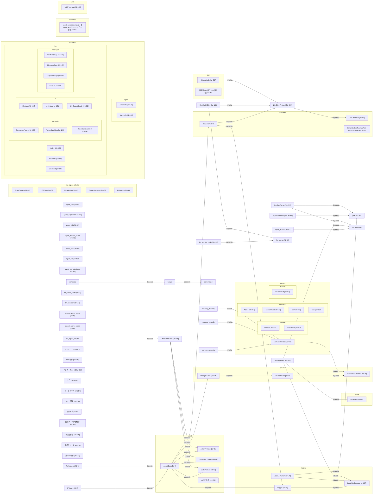

# 依存関係.drawio.svg

- nodes: 100
- edges: 37

## Warnings
- missing-node: referenced id=235 (added placeholder)

```mermaid
flowchart LR
  subgraph cluster_agent["agent"]
    agent_ActionProtocol["ActionProtocol [id=31]"]
    agent_Agent_Base["Agent Base [id=4]"]
    agent_Perception_Protocol["Perception Protocol [id=57]"]
    agent_StateProtocol["StateProtocol [id=52]"]
    agent_2["ハブになる [id=179]"]
  end
  agent_core["agent_core [id=80]"]
  agent_experiment["agent_experiment [id=82]"]
  agent_lebt["agent_lebt [id=84]"]
  agent_monitor["agent_monitor [id=90]"]
  agent_monitor_node["agent_monitor_node [id=173]"]
  agent_react["agent_react [id=85]"]
  agent_ros["agent_ros [id=183]"]
  agent_ros_interfaces["agent_ros_interfaces [id=193]"]
  subgraph cluster_bridge["bridge"]
    bridge_converter["converter [id=223]"]
  end
  BTAgent["BTAgent [id=5]"]
  subgraph cluster_dev["dev"]
    dev_OllamaModel["OllamaModel [id=237]"]
    dev_2["開発途中で使うもの 置き場 [id=243]"]
  end
  Experiment_Analyzer["Experiment Analyzer [id=64]"]
  hf_server_node["hf_server_node [id=91]"]
  subgraph cluster_hsr_agent_adapter["hsr_agent_adapter"]
    hsr_agent_adapter_FrontCamera["FrontCamera [id=58]"]
    hsr_agent_adapter_HSRState["HSRState [id=53]"]
    hsr_agent_adapter_MoveAction["MoveAction [id=36]"]
    hsr_agent_adapter_PerceptionAction["PerceptionAction [id=37]"]
    hsr_agent_adapter_PickAction["PickAction [id=35]"]
  end
  json["json [id=184]"]
  llm_monitor["llm_monitor [id=175]"]
  llm_monitor_node["llm_monitor_node [id=176]"]
  llm_server["llm_server [id=83]"]
  LlmClientProtocol["LlmClientProtocol [id=255]"]
  subgraph cluster_logging["logging"]
    logging_JsonLogWriter["JsonLogWriter [id=170]"]
    logging_Logger["Logger [id=20]"]
    logging_LogWriterProtocol["LogWriterProtocol [id=167]"]
  end
  subgraph cluster_memory["memory"]
    subgraph cluster_memory_episodic["episodic"]
      memory_episodic_Example["Example [id=107]"]
      memory_episodic_PastResult["PastResult [id=108]"]
    end
    memory_Memory_Protocol["Memory Protocol [id=71]"]
    subgraph cluster_memory_semantic["semantic"]
      memory_semantic_Action["Action [id=104]"]
      memory_semantic_Environment["Environment [id=103]"]
      memory_semantic_Self["Self [id=101]"]
      memory_semantic_User["User [id=102]"]
    end
    subgraph cluster_memory_working["working"]
      memory_working_RecentChat["RecentChat [id=113]"]
    end
  end
  ollama_server_node["ollama_server _node [id=92]"]
  openai_server_node["openai_server _node [id=93]"]
  subgraph cluster_prompt["prompt"]
    prompt_Prompt_Builder["Prompt Builder [id=74]"]
    prompt_PromptFrame["PromptFrame [id=73]"]
    prompt_PromptPart_Protocol["PromptPart Protocol [id=76]"]
  end
  ReActAgent["ReActAgent [id=6]"]
  subgraph cluster_reasoner["reasoner"]
    reasoner_LlmCallResult["LlmCallResult [id=246]"]
    reasoner_Reasoner["Reasoner [id=3]"]
    reasoner_SemanticRoleToActualRole_MappingStrategy["SemanticRoleToActualRole MappingStrategy [id=256]"]
  end
  ROS2["ROS2ノード [id=253]"]
  rosbag["rosbag [id=66]"]
  RosBagParser["RosBagParser [id=229]"]
  RosLogWriter["RosLogWriter [id=169]"]
  RosModelClient["RosModelClient [id=186]"]
  ROS["ROS依存 [id=192]"]
  subgraph cluster_schemas["schemas"]
    subgraph cluster_schemas_agent["agent"]
      schemas_agent_ActionInfo["ActionInfo [id=131]"]
      schemas_agent_AgentInfo["AgentInfo [id=133]"]
    end
    subgraph cluster_schemas_llm["llm"]
      schemas_llm_CallId["CallId [id=135]"]
      subgraph cluster_schemas_llm_generate["generate"]
        schemas_llm_generate_GenerationParams["GenerationParams [id=139]"]
        schemas_llm_generate_TokenCandidate["TokenCandidate [id=140]"]
        schemas_llm_generate_TokenCandidateSet["TokenCandidateSet [id=141]"]
      end
      subgraph cluster_schemas_llm_io["io"]
        schemas_llm_io_LlmInput["LlmInput [id=150]"]
        schemas_llm_io_LlmOutput["LlmOutput [id=151]"]
        schemas_llm_io_LlmOutputChunk["LlmOutputChunk [id=152]"]
      end
      subgraph cluster_schemas_llm_messages["messages"]
        schemas_llm_messages_InputMessage["InputMessage [id=146]"]
        schemas_llm_messages_MessageBase["MessageBase [id=145]"]
        schemas_llm_messages_OutputMessage["OutputMessage [id=147]"]
        schemas_llm_messages_Session["Session [id=144]"]
      end
      schemas_llm_ModelInfo["ModelInfo [id=134]"]
      schemas_llm_SessionId["SessionId [id=136]"]
    end
  end
  subgraph cluster_schemas_2["schemas"]
    schemas_agent_core_schemas_ROS2["agent_core.schemas以下をROS2メッセージでミラー定義 [id=195]"]
  end
  UNKNOWN_235["UNKNOWN 235 [id=235]"]
  subgraph cluster_utils["utils"]
    utils_uuid7_compat["uuid7_compat [id=119]"]
  end
  node["インターフェース [id=249]"]
  node_2["クラス [id=251]"]
  node_3["データクラス [id=254]"]
  node_4["フリー関数 [id=250]"]
  node_5["依存方向 [id=87]"]
  node_6["具体アイデアを試す [id=166]"]
  node_7["構造を作る [id=165]"]
  node_8["永続化データ [id=252]"]
  ROS_2["非ROS依存 [id=191]"]
  logging_Logger -->|"depends"| logging_LogWriterProtocol
  logging_JsonLogWriter -->|"inherits"| logging_LogWriterProtocol
  agent_Agent_Base -->|"depends"| agent_Perception_Protocol
  agent_Agent_Base -->|"depends"| agent_ActionProtocol
  agent_Agent_Base -->|"depends"| agent_StateProtocol
  agent_Agent_Base -->|"depends"| reasoner_Reasoner
  agent_Agent_Base -->|"depends"| logging_Logger
  prompt_PromptFrame -->|"depends"| prompt_PromptPart_Protocol
  prompt_Prompt_Builder -->|"depends"| prompt_PromptFrame
  agent_monitor -->|"depends"| rosbag
  RosLogWriter -->|"depends"| rosbag
  RosBagParser -->|"depends"| rosbag
  memory_semantic -->|"inherits"| memory_Memory_Protocol
  memory_episodic -->|"inherits"| memory_Memory_Protocol
  memory_working -->|"inherits"| memory_Memory_Protocol
  agent_Agent_Base -->|"depends"| prompt_Prompt_Builder
  memory_Memory_Protocol -->|"inherits"| prompt_PromptPart_Protocol
  BTAgent -->|"inherits"| agent_Agent_Base
  ReActAgent -->|"inherits"| agent_Agent_Base
  RosLogWriter -->|"inherits"| logging_LogWriterProtocol
  Experiment_Analyzer -->|"depends"| json
  llm_monitor_node -->|"depends"| llm_server
  logging_JsonLogWriter -->|"depends"| json
  RosModelClient -->|"inherits"| LlmClientProtocol
  RosModelClient -->|"depends"| llm_server
  bridge -->|"depends"| schemas_2
  schemas -->|"depends"| bridge
  RosBagParser -->|"depends"| json
  RosLogWriter -->|"depends"| bridge_converter
  UNKNOWN_235 -->|"inherits"| agent_Perception_Protocol
  UNKNOWN_235 -->|"inherits"| agent_ActionProtocol
  UNKNOWN_235 -->|"inherits"| agent_StateProtocol
  hsr_agent_adapter -->|"depends"| UNKNOWN_235
  dev_OllamaModel -->|"inherits"| LlmClientProtocol
  reasoner_Reasoner -->|"depends"| logging_Logger
  LlmClientProtocol -->|"depends"| reasoner_LlmCallResult
  reasoner_Reasoner -->|"depends"| LlmClientProtocol
```
